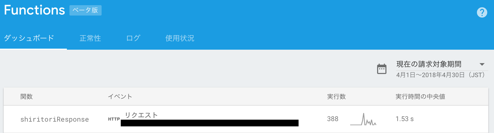

# google-home-shiritori

You can play "Shiritori" with your Google Home.

# Introduction
To use this app, you should
- have a Google account
- create Actions on Google
- deploy Firebase Functions
- deploy Actions SDK
- insert data in Firebase Realtime Database


# Local environment
- node (v6.11.5^)
- gactions (mention later)

## clone
- `git clone https://github.com/monstar-lab/google-home-shiritori.git`


# Creating Actions on Google
1. Click "Add/import project" on [Actions on Google Console](https://console.actions.google.com)
1. Write down your [project-name (actions)], choose your country and create project
1. Click "Actions SDK"
1. Download `gactions` from [the cite of gactions-cli](https://developers.google.com/actions/tools/gactions-cli) and execute `chmod u+x gactions`
1. move `gactions` to `google-home-shiritori`


# Deploying Firebase Functions
1. Open your [Firebase Console](https://console.firebase.google.com), write down your [project-name (firebase)] [project-id] and create new project
1. `npm install -g firebase-tools`
1. Execute `firebase login` and login to Firebase-cli according to the instruction
1. Execute `firebase init functions` in `google-home-shiritori/`
1. Choose [project-name (firebase)]
1. Answer like below
    ```
    ? What language would you like to use to write Cloud Functions? JavaScript
    ? Do you want to use ESLint to catch probable bugs and enforce style? No
    ? File functions/package.json already exists. Overwrite? No
    ? File functions/index.js already exists. Overwrite? No
    ? Do you want to install dependencies with npm now? Yes
    ```
1. Deploy `firebase deploy --only functions`


# Deploying Actions SDK
1. Execute `./gactions init`
1. Edit `action.json` like below
    ```json
    {
      "actions": [
        {
          "description": "Default Welcome Intent",
          "name": "MAIN",
          "fulfillment": {
            "conversationName": "shiritoriFunction"
          },
          "intent": {
            "name": "actions.intent.MAIN",
            "trigger": {
              "queryPatterns": [
                "しりとりアプリにつないで"
              ]
            }
          }
        },
        {
          "name": "SHIRITORI",
          "fulfillment": {
            "conversationName": "shiritoriFunction"
          },
          "intent": {
            "name": "actions.intent.TEXT",
            "parameters": {
              "name": "shiritoriWord",
              "type": "Shiritori"
            },
            "trigger": {
              "queryPatterns": [
                "$Shiritori:shiritoriWord"
              ]
            }
          }
        }
      ],
      "conversations": {
        "shiritoriFunction": {
          "name": "shiritoriFunction",
          "url": [URL of Firebase Functions]
        }
      },
      "locale": "ja"
    }
    ```
    Your URL of Firebase Functions is displayed on your Firebase Console.
    
1. Execute `./gactions update --action_package action.json --project [project名(actions)]`


# Inserting data in Firebase Realtime Database
1. Edit `data.json`. `dictionary` is the vocabulary list of the Google Home
1. Click "Database" from [Firebase Console](https://console.firebase.google.com)
1. Create Realtime Database and import data from JSON
1. Import `data.json`